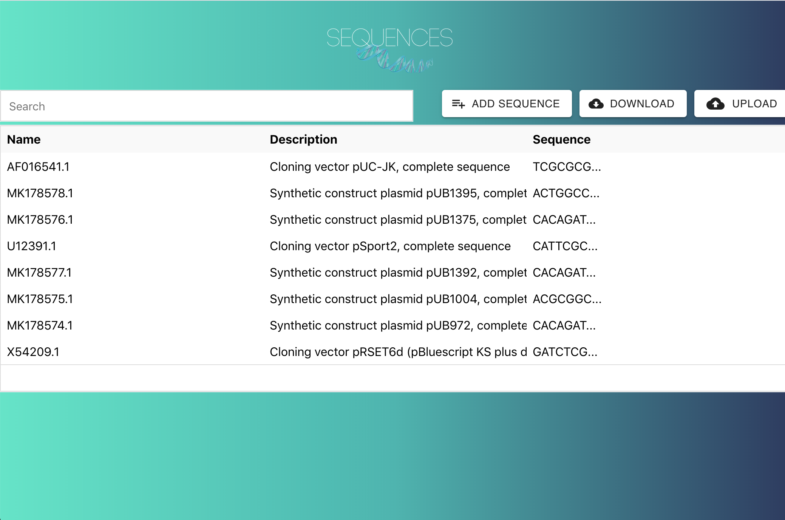
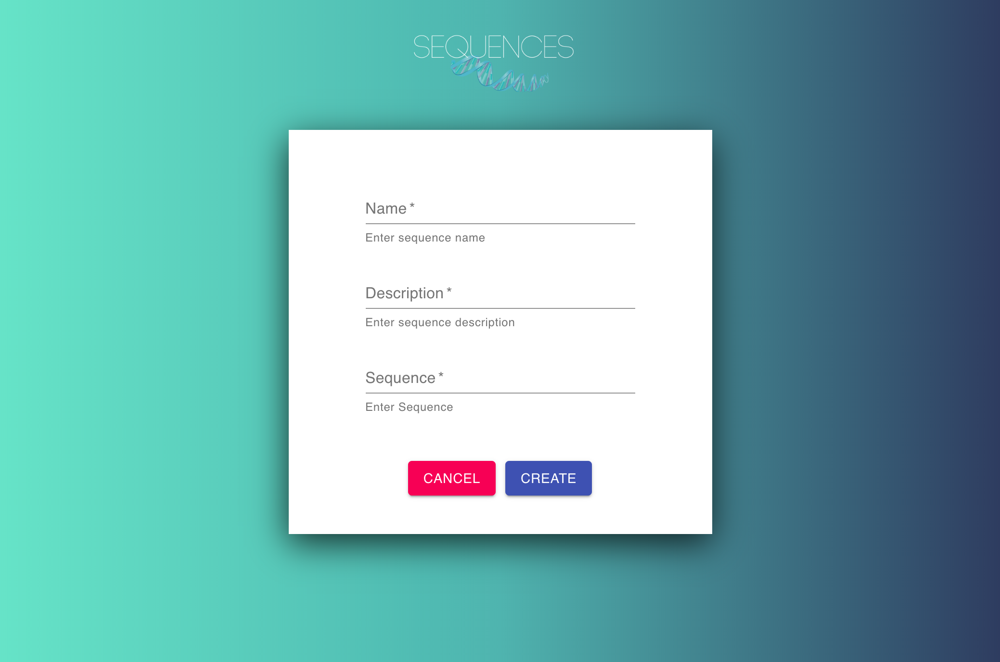

# Sequences

## TL;DR

- Clone directory
- In the ```frontendchallenge``` directory type the following:
    - ```npm install```
    - ```npm start``` 

## About

This is a simple interface built using ReactJS and Django, that allows users to upload, visualize, and validate DNA sequences.  The application enables users to view existing DNA sequences in a table format, add sequences using a form, and view full DNA sequences with color coding.  DNA sequences can also be imported via the "Upload" button, as well as exported using the "Download" button.  The "Download" button will give the user a json file of the sequences stored in the table.  

**Note**: The uploaded file must be in ```application/json``` format

## Preview



